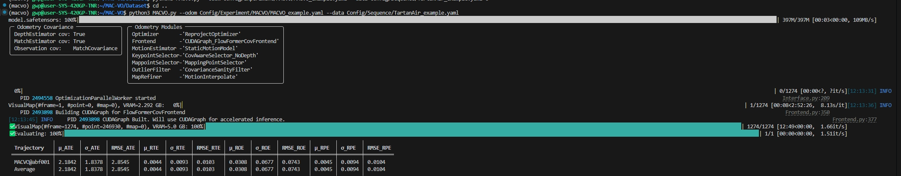
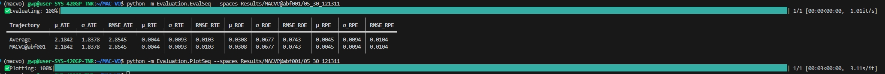
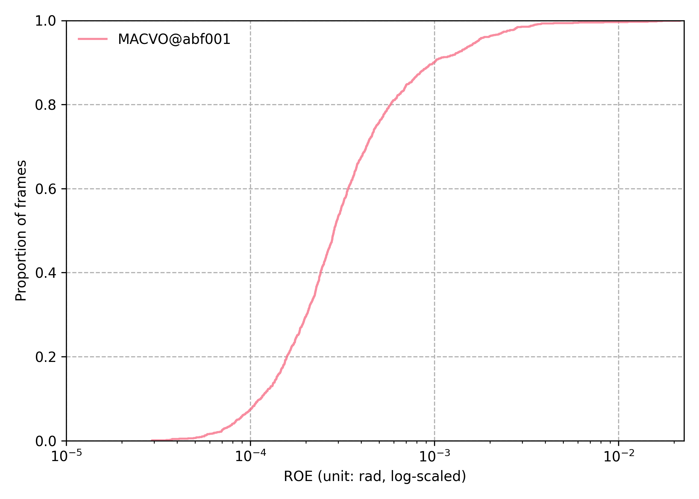
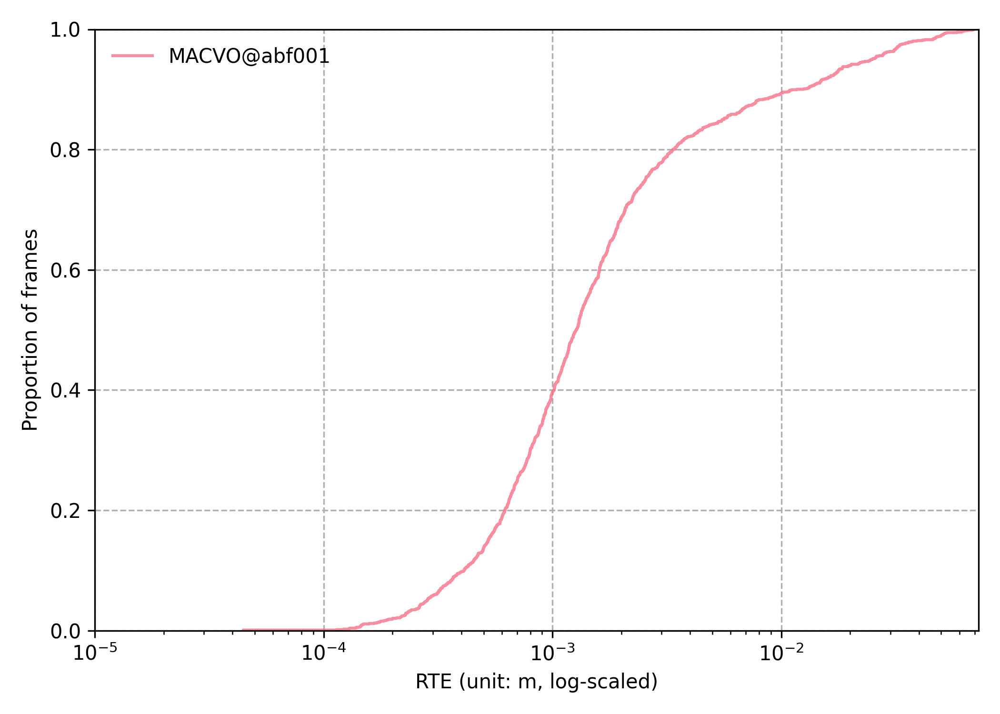
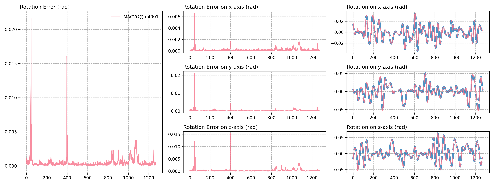
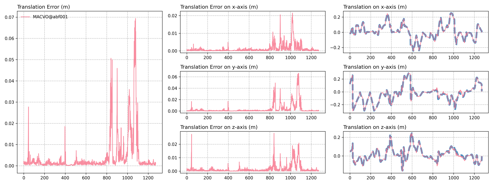
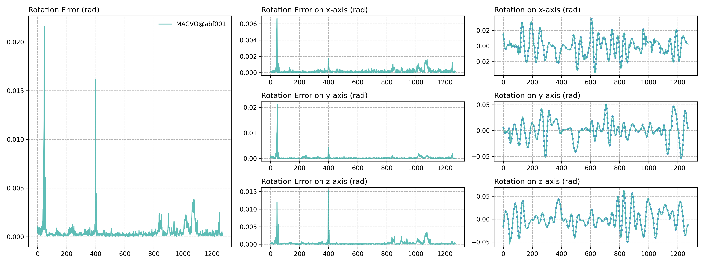
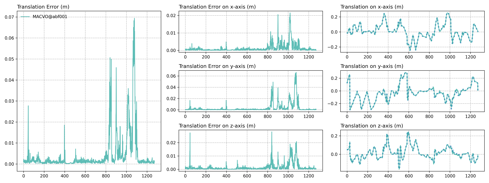
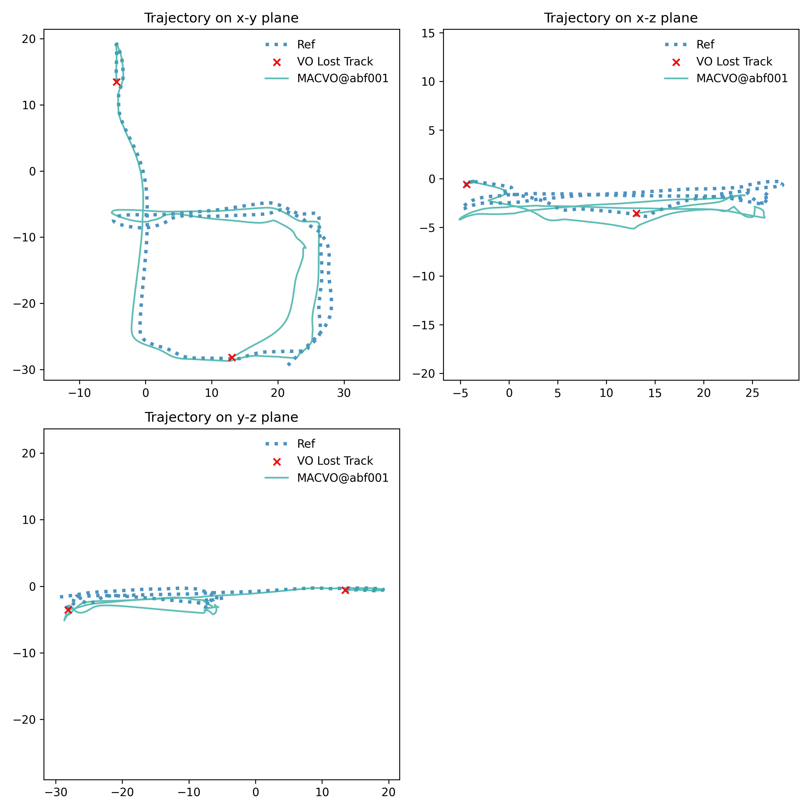
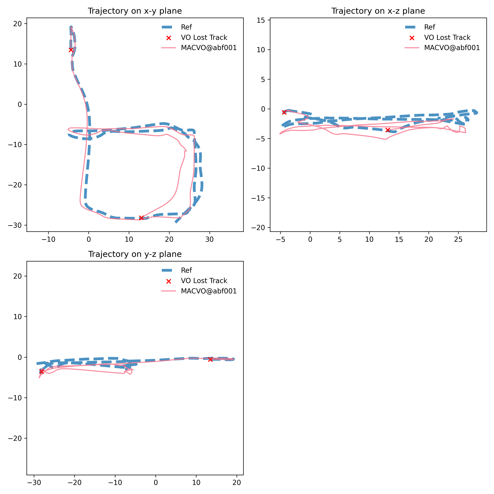

<div align="center">
<h1>测试 （ICRA 2025）MAC-VO: Metrics-aware Covariance for Learning-based Stereo Visual Odometry</h1>
</div>


## 配置过程

```bash
git clone https://github.com/R-C-Group/MAC-VO.git --recursive
# rm -rf .git

conda create -n macvo python=3.10.11
conda activate macvo
#  conda remove --name macvo --all

pip install -r requirements.txt

```

* 下载模型

```bash
$ mkdir Model
$ wget -O Model/MACVO_FrontendCov.pth https://github.com/MAC-VO/MAC-VO/releases/download/model/MACVO_FrontendCov.pth
$ wget -O Model/MACVO_posenet.pkl https://github.com/MAC-VO/MAC-VO/releases/download/model/MACVO_posenet.pkl
```

* 下载数据

```bash
pip install gdown

gdown https://drive.google.com/uc?id=标识符

mkdir Dataset
gdown https://drive.google.com/uc?id=1kCTNMW2EnV42eH8g2STJHcVWEbVKbh_r

```

然后修改`Config/Experiment/MACVO/MACVO_example.yaml`中的数据路径`Data: !include ../../Sequence/TartanAir_example.yaml`也就是对应的`root`
然后运行代码如下：

```bash
python3 MACVO.py --odom Config/Experiment/MACVO/MACVO_example.yaml --data Config/Sequence/TartanAir_example.yaml

```

<div align="center">
  
<figcaption>  
</figcaption>
</div>

* 接下来进行可视化以及验证结果

```bash
# 验证精度
python -m Evaluation.EvalSeq --spaces SPACE_0, [SPACE, ...]
python -m Evaluation.EvalSeq --spaces Results/MACVO@abf001/05_30_121311

# 画轨迹
python -m Evaluation.PlotSeq --spaces SPACE_0, [SPACE, ...]
python -m Evaluation.PlotSeq --spaces Results/MACVO@abf001/05_30_121311

```

<div align="center">
  
<figcaption>  
</figcaption>
</div>

<div align="center">
  <table style="border: none; background-color: transparent;">
    <tr align="center">
      <td style="width: 50%; border: none; padding: 0.01; background-color: transparent; vertical-align: middle;">
        
        Combined_ROEcdf
      </td>
      <td style="width: 50%; border: none; padding: 0.01; background-color: transparent; vertical-align: middle;">
        
        Combined_RTEcdf
      </td>
    </tr>
  </table>
  <figcaption>
  </figcaption>
</div>

<div align="center">
  
<figcaption>  
Combined_rrel
</figcaption>
</div>

<div align="center">
  
<figcaption>  
Combined_trel
</figcaption>
</div>

<div align="center">
  
<figcaption>  
MACVO@abf001_RotationErr
</figcaption>
</div>

<div align="center">
  
<figcaption>  
MACVO@abf001_TranslationErr
</figcaption>
</div>

<div align="center">
  
<figcaption>  
MACVO@abf001_Trajectory
</figcaption>
</div>

<div align="center">
  
<figcaption>  
Ref_Compare
</figcaption>
</div>

* 而对于mapping module，其不会执行pose的优化